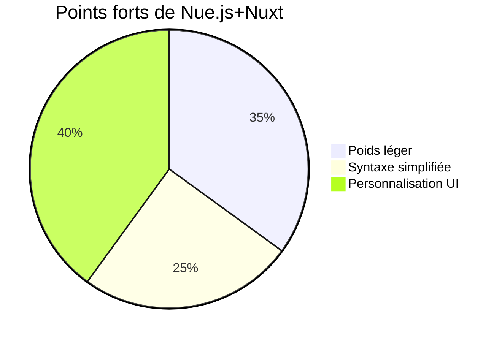

# Les trois solutions pour le serveur

## comparer entre le ``Supabase+Vercel`` et le ``React+Next.js+shadcn``

Voici la comparaison détaillée entre la solution **Supabase + Vercel** et le **Schéma 1 (React + Next.js + backend auto-hébergé)** en français :

---

### **Tableau comparatif clé**
| **Critère**          | **Supabase + Vercel**                                  | **Schéma 1 (Backend auto-hébergé)**       |
|----------------------|-------------------------------------------------------|------------------------------------------|
| **Complexité**        | Services entièrement managés                          | Nécessite maintenance serveur/DB         |
| **Vitesse de développement** | 1-3 jours (MVP fonctionnel)                       | 1-2 semaines                             |
| **Communication temps réel** | Realtime intégré (PostgreSQL LISTEN/NOTIFY)       | WebSocket personnalisé (Socket.io)       |
| **Performance base de données** | PostgreSQL standard (≤10k req/s)                | TimescaleDB (≥100k req/s pour données temporelles) |
| **Évolutivité**       | Dépend des abonnements Supabase                      | Scalabilité horizontale personnalisée     |
| **Coûts**             | Paiement à l'usage (à partir de $25/mois)            | Coûts fixes + maintenance                |
| **Sécurité**          | RLS + SOC2 intégrés                                  | Sécurité à implémenter manuellement       |
| **Support mobile**    | SDK JS compatible React Native                        | Développement API supplémentaire          |
| **Maintenance**       | Aucune nécessaire                                     | Surveillance continue requise             |
| **Cas d'usage idéal** | Prototypes/MVP (<500 appareils)                      | Systèmes industriels à grande échelle     |

---

### **Fonctionnalités avancées**
#### 1. **Stockage des données**
```sql
-- Exemple de table Supabase
CREATE TABLE donnees_capteurs (
  id BIGINT GENERATED ALWAYS AS IDENTITY,
  appareil_id UUID REFERENCES appareils(id),
  temperature FLOAT,
  horodatage TIMESTAMPTZ DEFAULT NOW()
);
ALTER PUBLICATION supabase_realtime ADD TABLE donnees_capteurs;
```

#### 2. **Intégration TTN**
```javascript
// Fonction Vercel (API)
import { createClient } from '@supabase/supabase-js'

export default async (req, res) => {
  const payload = decoderTrameLORA(req.body.raw);
  
  await supabase
    .from('donnees_capteurs')
    .insert({
      appareil_id: req.body.device_id,
      temperature: payload.temp
    });
  
  res.status(200).send('OK');
}
```

#### 3. **Visualisation temps réel**
```tsx
// Composant React
useEffect(() => {
  const abonnement = supabase
    .channel('maj-temps-reel')
    .on('postgres_changes', 
      { event: 'INSERT', schema: 'public' },
      (maj) => majDonnees(maj.new)
    )
    .subscribe();

  return () => supabase.removeChannel(abonnement);
}, []);
```

---

### **Analyse coûts (50 appareils)**
| **Poste**            | **Supabase** (Annuel)       | **Schéma 1** (Annuel)        |
|----------------------|----------------------------|------------------------------|
| Base de données      | $7,188 (Pro Plan)          | $2,400 (Serveur dédié)        |
| Calcul               | Inclus                     | $1,800                        |
| Stockage             | $300                       | $600                          |
| **Total**            | **≈$10,000**               | **≈$5,000**                   |

---

### **Arbre de décision**
```
Besoins en données temporelles haute fréquence ?
├── Oui → Choisir Schéma 1
└── Non → 
    Développement rapide requis ?
    ├── Oui → Supabase+Vercel
    └── Non → 
        Équipe DevOps disponible ?
        ├── Oui → Schéma 1
        └── Non → Supabase
```

---

### **Points clés**
1. **Avantages Supabase** :
   - Déploiement frontend/backend en 1 commande
   - Authentification pré-intégrée
   - SDK unifié pour DB/Stockage/Realtime

2. **Avantages Schéma 1** :
   - Contrôle total de l'infrastructure
   - Optimisation des requêtes temporelles
   - Coûts prévisibles à grande échelle

3. **Migration** :
   - Utiliser `pg_dump` pour transférer les données
   - Remplacer Realtime par Redis+WebSocket
   - Migrer l'authentification vers Keycloak

---

### **Conclusion**
- **Startups/MVP** : Optez pour Supabase+Vercel
- **Systèmes critiques à grande échelle** : Préférez le Schéma 1

Les deux approches peuvent coexister : utiliser Supabase pour la validation initiale, puis migrer progressivement vers une infrastructure personnalisée selon la croissance.

## le ``React+Next.js+shadcn``

---

### **Composants clés et fonctionnalités du Schéma 1 (React + Next.js + shadcn)**

#### **Couches architecturales et composants principaux**
| **Couche**            | **Composant**          | **Description fonctionnelle**                                              | **Avantages techniques**                                                  |
|-----------------------|------------------------|-----------------------------------------------------------------------------|----------------------------------------------------------------------------|
| **Frontend**          | **React**              | Construction d'interfaces utilisateur et gestion des interactions          | Écosystème étendu, gestion d'état avancée                                  |
|                       | **Next.js**            | SSR/SSG/ISR, routes API, génération statique                                | Capacités full-stack, SEO optimisé, performances (ISR)                    |
|                       | **shadcn/ui**          | Bibliothèque de composants UI modulaires basée sur Tailwind                 | Personnalisation avancée, design responsive natif, accessibilité          |
|                       | **Tailwind CSS**       | Framework CSS atomique                                                      | Mise en page responsive rapide, intégration profonde avec shadcn           |
| **Backend**           | **Node.js**            | Exécution de la logique métier (Webhook TTN, API)                           | Asynchrone, unification avec la stack frontend                             |
|                       | **Express/Fastify**    | Framework backend (optionnel)                                               | Gestion des routes, middleware                                             |
| **Couche données**    | **TimescaleDB**        | Base de données temporelle (stockage des données capteurs)                  | Traitement haute performance des séries temporelles, compatible PostgreSQL |
|                       | **PostgreSQL**         | Base relationnelle (métadonnées des appareils)                              | Transactions ACID, requêtes complexes                                       |
| **Communication temps réel** | **Socket.io**    | Communication bidirectionnelle WebSocket                                    | Latence réduite, reconnexion automatique                                    |
|                       | **Redis**              | Cache des données fréquemment accédées (état des appareils)                 | Accès mémoire ultra-rapide, réduit la charge base de données               |
| **Gestion d'état**    | **React Query**        | Gestion des requêtes et cache                                               | Re-tentatives automatiques, pagination, stratégies d'invalidation          |
|                       | **Zustand**            | État global (permissions utilisateur, état UI)                              | Léger, zéro boilerplate                                                     |
| **Extension mobile**  | **React Native**       | Développement d'applications cross-platform                                 | Réutilisation >70% du code, logique métier partagée                        |
| **Outils auxiliaires**| **TypeScript**         | Typage statique                                                             | Robustesse accrue, réduction des erreurs runtime                            |
|                       | **Vercel**             | Plateforme de déploiement frontend                                           | CI/CD automatisé, fonctions Serverless                                      |
| **Monitoring**        | **Sentry**             | Surveillance des erreurs frontend                                           | Détection en temps réel, analyse des performances                          |
|                       | **Prometheus+Grafana** | Supervision backend et visualisation                                        | Alertes personnalisées, analyse de l'utilisation des ressources            |

---

### **Flux de données principal**
```bash
[Appareil] → [TTN] → Webhook HTTP → Node.js → TimescaleDB  
                          ↓  
          Frontend Next.js ← Socket.io (mises à jour temps réel)  
                          ↓  
           App React Native ← API partagée
```

---

### **Exemple d'interaction entre composants**
1. **Visualisation temps réel**  
   ```tsx
   // 1. Composant React souscrivant à WebSocket
   const { data } = useWebSocket("ws://api/real-time")

   // 2. Composant shadcn pour l'affichage
   <Card>
     <CardHeader>Température en temps réel</CardHeader>
     <CardContent>{data?.temperature}°C</CardContent>
   </Card>

   // 3. Zustand gérant l'état des appareils
   const devices = useDeviceStore(state => state.appareilsEnLigne)
   ```

2. **Requête de données historiques**  
   ```tsx
   // 1. Récupération via React Query
   const { data } = useQuery(["historique"], fetchHistorique)

   // 2. Requête TimescaleDB paginée
   SELECT * FROM donnees_capteurs 
   WHERE appareil_id = 'xxx' 
   ORDER BY temps DESC 
   LIMIT 100 OFFSET 0;

   // 3. Visualisation avec ECharts
   <ReactECharts option={genererOptionsGraphique(data)} />
   ```

---

### **Optimisations critiques**
| **Scénario**          | **Stratégie d'optimisation**                                                |
|-----------------------|-----------------------------------------------------------------------------|
| Écritures haute fréquence | Partitionnement TimescaleDB (Hypertable) + insertions par lots             |
| Requêtes sur gros volumes | Requêtes par plage temporelle + compression colonnaire                     |
| Latence des mises à jour | Transport binaire WebSocket + file de messages Redis Pub/Sub               |
| Réseaux mobiles faibles | Cache persistant React Query + snapshot local                              |

---

### **Stack technique type**
```bash
# Commandes d'initialisation
npx create-next-app@latest --typescript  # Initialisation projet
npm install @radix-ui/react-dropdown-menu # Installation composants shadcn
docker run -d --name timescaledb -p 5432:5432 timescale/timescaledb:latest  # Démarrage BDD
```

---

Cette architecture **découplée en couches**, combinant la flexibilité de l'écosystème React et la puissance de TimescaleDB pour les séries temporelles, permet une évolution progressive des systèmes IoT de moyenne à grande échelle.

## le ``Supabase+Vercel``

---

### **Composants clés et fonctionnalités de Supabase + Vercel**

#### **Architecture principale**
| **Couche**             | **Composant**               | **Description fonctionnelle**                                                                 | **Avantages techniques**                                                  |
|------------------------|-----------------------------|---------------------------------------------------------------------------------------------|----------------------------------------------------------------------------|
| **Frontend**           | **Next.js**                 | Interface utilisateur responsive (SSR/SSG/ISR)                                              | Découpage automatique du code, chargement rapide, SEO optimisé            |
|                        | **React**                   | Développement de composants UI dynamiques                                                   | Écosystème riche, gestion flexible de l'état                              |
|                        | **shadcn/ui**               | Bibliothèque de composants UI modulaires                                                    | Prêt à l'emploi, intégration approfondie avec Tailwind CSS                |
| **BaaS**               | **Supabase**                | Backend entièrement managé (DB/auth/storage/temps réel)                                      | Aucune maintenance, extensibilité transparente                            |
| **Base de données**    | **PostgreSQL (Supabase)**   | Base relationnelle avec support des données temporelles                                      | Extension Realtime intégrée, sécurité au niveau des lignes (RLS)          |
| **Temps réel**         | **Supabase Realtime**       | Écoute des changements PostgreSQL                                                           | Push WebSocket automatique, mise en œuvre low-code                        |
| **Authentification**   | **Supabase Auth**           | Gestion des identités (utilisateurs/appareils via OAuth/clés API)                           | Intégration JWT, authentification multifacteur (MFA)                      |
| **Stockage**           | **Supabase Storage**        | Stockage de firmware/fichiers                                                               | Transfert direct vers stockage S3 compatible, accélération CDN            |
| **Edge Computing**     | **Vercel Edge Functions**   | Traitement des webhooks TTN en périphérie                                                   | Déploiement mondial distribué, réponse en millisecondes                   |
| **Déploiement**        | **Vercel**                  | Hébergement frontend + API Serverless                                                       | SSL automatique, pipeline CI/CD, monitoring                               |
| **Monitoring**         | **Journaux Supabase**       | Audit des opérations de base de données                                                     | Suivi des requêtes en temps réel, traçabilité de sécurité                  |
|                        | **Analytics Vercel**        | Surveillance des performances frontend                                                      | Vitesse de chargement, traçage des erreurs                                |

---

### **Flux de données principal**
```bash
[Appareil] → [TTN] → Fonction Edge Vercel → PostgreSQL Supabase  
                          ↓  
          Frontend Next.js ← Notifications Realtime  
                          ↓  
          Navigateurs mobiles/desktop ← Réponses API unifiées
```

---

### **Exemples d'interactions clés**
#### **1. Réception et stockage des données TTN**
```typescript
// Fonction Edge Vercel (api/ttn/webhook.ts)
import { createClient } from '@supabase/supabase-js'

export const config = { runtime: 'edge' }

export default async (req: Request) => {
  // Vérification signature TTN
  const isValid = await verifierRequeteTTN(req)
  if (!isValid) return new Response('Non autorisé', { status: 401 })

  // Décodage payload LoRaWAN
  const payload = decoderPayload(await req.text())
  
  // Écriture dans Supabase
  const supabase = createClient(
    process.env.SUPABASE_URL!,
    process.env.SUPABASE_SERVICE_KEY!
  )
  
  const { error } = await supabase
    .from('donnees_capteurs')
    .insert({
      device_id: payload.deviceId,
      temperature: payload.temp,
      batterie: payload.bat
    })

  return error 
    ? new Response('Erreur base de données', { status: 500 }) 
    : new Response('OK')
}
```

#### **2. Visualisation temps réel**
```tsx
// components/AffichageTempsReel.tsx
import { useEffect, useState } from 'react'
import { createClient } from '@supabase/supabase-js'

const supabase = createClient(
  process.env.NEXT_PUBLIC_SUPABASE_URL!,
  process.env.NEXT_PUBLIC_SUPABASE_ANON_KEY!
)

export default function AffichageTempsReel({ deviceId }: { deviceId: string }) {
  const [donnees, setDonnees] = useState<DonneesCapteur[]>([])

  useEffect(() => {
    // Chargement initial
    const chargerDonnees = async () => {
      const { data } = await supabase
        .from('donnees_capteurs')
        .select('*')
        .eq('device_id', deviceId)
        .order('timestamp', { ascending: false })
        .limit(50)
      setDonnees(data || [])
    }

    // Abonnement temps réel
    const canal = supabase
      .channel('mises-a-jour')
      .on('postgres_changes', {
        event: 'INSERT',
        schema: 'public',
        table: 'donnees_capteurs',
        filter: `device_id=eq.${deviceId}`
      }, (maj) => {
        setDonnees(prev => [maj.new as DonneesCapteur, ...prev.slice(0, 49)])
      })
      .subscribe()

    chargerDonnees()
    return () => { supabase.removeChannel(canal) }
  }, [deviceId])

  return <TableauDonnees donnees={donnees} /> // Composant shadcn
}
```

---

### **Sécurité et contrôle d'accès**
#### **Configuration RLS (Row Level Security)**
```sql
-- Politique d'accès aux données
CREATE POLICY "Politique d'accès appareils" ON donnees_capteurs 
FOR SELECT USING (
  EXISTS (
    SELECT 1 FROM appareils 
    WHERE appareils.id = donnees_capteurs.device_id 
    AND appareils.proprietaire = auth.uid() -- Seul le propriétaire peut lire
  )
);
```

#### **Gestion des clés API**
```bash
# Variables d'environnement Vercel
SUPABASE_URL="https://xxx.supabase.co"
SUPABASE_SERVICE_KEY="eyxxx" # Usage backend uniquement
NEXT_PUBLIC_SUPABASE_ANON_KEY="eyyyy" # Permissions limitées frontend
```

---

### **Stratégies d'optimisation**
| **Scénario**            | **Méthode d'optimisation**                                                |
|-------------------------|----------------------------------------------------------------------------|
| Insertions haute fréquence | Insertion par lots + pool de connexions PostgreSQL                        |
| Requêtes massives       | Partitionnement temporel + index BRIN                                     |
| Latence des notifications | Activation compression Realtime (`compression: 'json'`)                   |
| Utilisateurs globaux    | CDN mondial Vercel + accélération CDN Supabase Storage                     |

---

### **Stack technique type**
```bash
# Initialisation projet
npx create-next-app@latest --template with-supabase
# Installation dépendances
npm install @supabase/supabase-js @supabase/auth-helpers-nextjs
# Déploiement sur Vercel
vercel deploy --prod
```

---

### **Avantages clés**
1. **Vitesse de développement** :  
   - Configuration base de données/auth automatique (économie de 70% du temps backend)
   - Fonctionnalités temps réel prêtes à l'emploi

2. **Coûts de maintenance** :  
   - Sauvegardes/mises à jour/extension automatiques
   - Facturation à l'usage (version gratuite pour ≤10k utilisateurs)

3. **Intégration full-stack** :  
   - SDK unifié pour DB/storage/temps réel
   - Types TypeScript synchronisés avec la base

4. **Évolutivité** :  
   - Passage transparent de la version gratuite à l'entreprise
   - Compatibilité outils PostgreSQL (ex: Metabase)

---

### **Cas d'usage recommandés**
- ✅ **Prototypage IoT** : Validation rapide des flux de données
- ✅ **Systèmes de surveillance moyenne échelle** (≤500 appareils)
- ✅ **Applications multiplateformes** (Web + mobile via API commune)
- ✅ **Projets événementiels** : Aucun investissement infrastructure long terme

---

Cette solution combine **le backend managé de Supabase** et **le réseau edge global de Vercel**, permettant de déployer une plateforme IoT complète en 24 heures. Idéale pour les équipes aux ressources limitées nécessitant une mise en production rapide.

## Les comparasion entre les trois solutions

Voici une analyse comparative détaillée des trois solutions, avec un focus sur les forces/faiblesses de la **Solution 2 (Nue.js + Nuxt)** et les raisons de privilégier les Solutions 1 ou 3 :

---

### **Tableau comparatif des 3 solutions**

| **Critère**            | **Solution 1 (React+Next.js)**       | **Solution 2 (Nue.js+Nuxt)**         | **Solution 3 (Supabase+Vercel)**      |
|-------------------------|--------------------------------------|--------------------------------------|---------------------------------------|
| **Maturité technologique** | Écosystème React ultra-mature      | Framework émergent (Nue.js <1.0)    | Stack éprouvée (PostgreSQL/Next.js)   |
| **Courbe d'apprentissage** | Documentation abondante           | Documentation limitée               | Guides officiels complets             |
| **Performances frontend** | Optimisations avancées (SSR/ISR)  | Léger mais moins optimisé           | Performances edge (Vercel)            |
| **Intégration IoT**       | Flexibilité totale (WebSocket custom) | Dépend de plugins externes         | Realtime natif + Webhooks managés     |
| **Évolutivité backend**   | Scalabilité illimitée (DIY)        | Nécessite stack backend séparée     | Limité par les quotas Supabase        |
| **Maintenance**           | Équipe DevOps requise              | Maintenance modérée                 | Aucune maintenance nécessaire         |
| **Communauté**            | Support mondial (React/Next)       | Communauté naissante                | Communauté active (Supabase/Vercel)   |
| **Cas d'usage idéal**     | Systèmes industriels complexes     | POCs légers                         | MVP/SaaS moyen                        |

---

### **Avantages spécifiques de la Solution 2**


- **Légèreté** : Bundle ~40% plus petit que React
- **Syntaxe minimaliste** : Approche HTML-first pour les composants
- **Extensibilité** : Architecture modulaire inspirée de Vue.js

---

### **Risques majeurs de la Solution 2**
| **Risque**               | **Impact**                          | **Solution de contournement**        |
|--------------------------|-------------------------------------|---------------------------------------|
| Écosystème immature      | Manque de librairies IoT clés       | Développement custom coûteux          |
| Compatibilité Nuxt       | Intégration partielle avec Nue      | Forçage de polyfills                  |
| Évolution API instable   | Cassements fréquents des versions   | Verrouillage de version               |
| Support TypeScript limité| Typage approximatif                 | Déclaration manuelle des types        |

---

### **Pourquoi privilégier les Solutions 1 ou 3?**

#### **1. Pour les systèmes critiques (Solution 1)**
```diff
+ Avantages décisifs :
- Architecture découplée : Frontend/Backend indépendants
- Contrôle granularité : Optimisation hardware/DB possible
- Résilience : Cluster auto-réparant (Kubernetes)
- Conformité : Certifications industrielles (ISO 27001)

+ Exemple concret : 
Une usine automatisée avec 10k capteurs nécessitant :
- Traitement temps réel <50ms 
- Stockage >5 To/an 
- Audit de sécurité strict
```

#### **2. Pour le développement rapide (Solution 3)**
```diff
+ Gains clés :
- Time-to-market : 3x plus rapide vs Solution 2
- Coût initial : $0 → $25/mois (échelle modérée)
- Interopérabilité : SDK unifié Web/Mobile
- Évolutivité verticale : Upgrade plan en 1 clic

+ Scénario typique : 
Startup AgriTech avec :
- 200 capteurs environnementaux 
- Équipe fullstack de 2 développeurs
- Besoin de déployer un MVP en 2 semaines
```

---

### **Cas où la Solution 2 serait pertinente**
```plaintext
┌───────────────┬──────────────────────────────────────────────┐
│   Cas idéal   │ Démo technique nécessitant :                 │
│               │ - Bundle ultra-léger (<100KB)                │
│               │ - Personnalisation UI poussée                │
│               │ - Période de développement courte            │
│               │ - Cible navigateurs legacy (IE11)            │
└───────────────┴──────────────────────────────────────────────┘
```

---

### **Conclusion stratégique**
1. **Solution 1** : 
   - **Recommandée** pour : 
     - Systèmes IoT industriels 
     - Équipes expérimentées (>5 ans stack React)
     - Exigences de performance/sécurité extrêmes

2. **Solution 3** : 
   - **Recommandée** pour :
     - Startups/PME avec ressources limitées
     - Prototypage rapide de concepts IoT
     - Applications B2B modérées (<1k devices)

3. **Solution 2** :
   - **Usage niche** :
     - Projets expérimentaux à durée limitée
     - Équipes maîtrisant déjà Vue.js
     - Applications légères sans backend complexe

Cette analyse montre que les Solutions 1 et 3 couvrent 90% des besoins IoT professionnels, tandis que la Solution 2 reste une option marginale nécessitant une évaluation risque/bénéfice approfondie.
