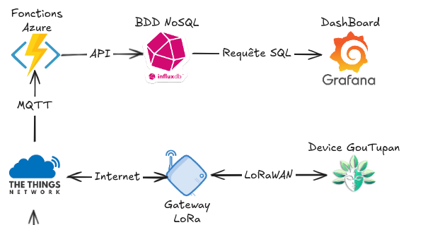

# DataFlow

Les codes dans ce dossier ont été utilisés pour la conception du MVP de notre solution. Les fichiers Python présents ici ont été utilisés pour créer une fonction Azure pour consommer les données de TTN et les envoyer à InfluxDB, qui sont consommées par un tableau de bord Grafana accessible via le lien : [grafana.danlara.com.br](http://grafana.danlara.com.br)



# Instalation

## Prérequis
Assurez-vous que le fichier `.env` est correctement rempli avec les informations nécessaires.

Les informations sont l'accès aux sujets MQTT de [The Things Network](https://www.thethingsnetwork.org/) de votre organisation et les données de votre organisation dans [InfluxDB](https://www.influxdata.com/).

## Étapes

1. **Créer un environnement virtuel**

    Ouvrez un terminal et naviguez jusqu'au dossier contenant les fichiers Python. Ensuite, exécutez les commandes suivantes :

    ```sh
    python3 -m venv venv
    ```

2. **Activer l'environnement virtuel**

    - Sur **Linux/MacOS** :

      ```sh
      source venv/bin/activate
      ```

    - Sur **Windows** :

      ```sh
      .\venv\Scripts\activate
      ```

3. **Installer les dépendances**

    Assurez-vous que vous êtes dans l'environnement virtuel activé, puis installez les dépendances nécessaires :

    ```sh
    pip install -r requirements.txt
    ```

4. **Exécuter les fichiers Python**

    Avec l'environnement virtuel activé, exécutez les fichiers Python :

    ```sh
    python ttn_influx_v1.py # MVP du 03/03/2025
    python ttn_influx_v2.py # Final Version
    ```